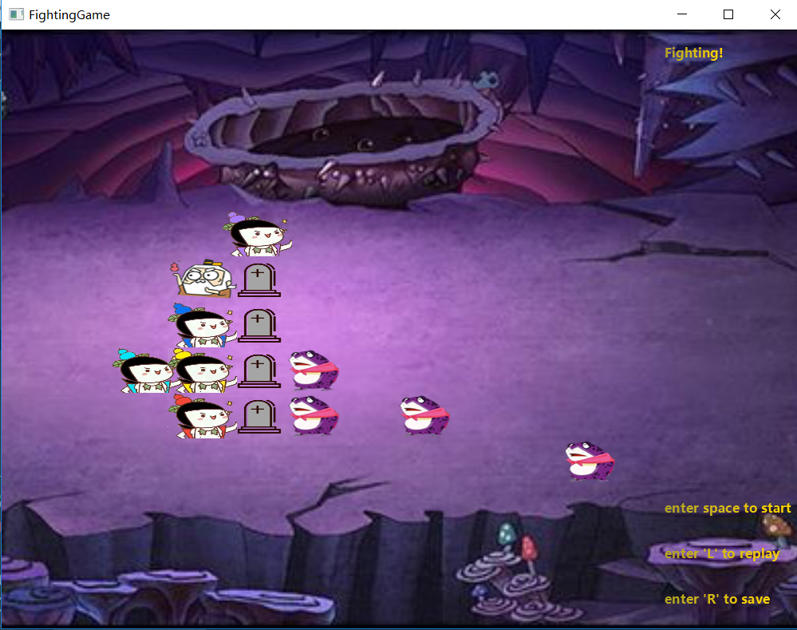
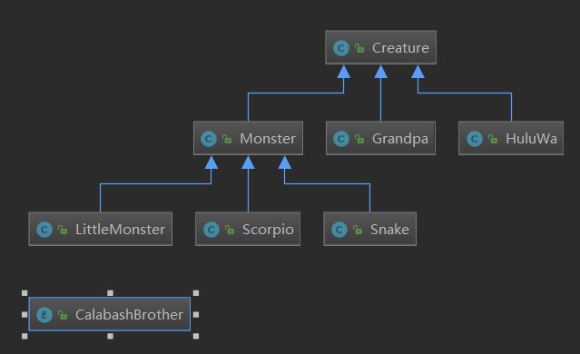
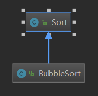

# Final Project  
## 开发环境  
* IDE : IntelliJ IDEA 2018.2
* java环境 :  
&emsp;&emsp;java 10.0.2 2018-07-17  
&emsp;&emsp;Java(TM) SE Runtime Environment 18.(build10.0.2+13)  
&emsp;&emsp;Java HotSpot(TM) 64-Bit Server VM 18.3 (build 10.0.2+13, mixed mode)
* Maven 3.6.0  
## 运行简介  
* 通过`mvn clean test package`得到的位于target目录下的jar包可以直接运行  
* 敲击空格开始一次新的游戏，葫芦娃固定按长蛇阵排列，妖怪将从8个阵型中随机选择一个排列。爷爷将在长蛇阵后方随机选择一个位置，蛇精同理随机确定一个战场位置。游戏开始时会在游戏运行目录创建一个临时文件fightlog来临时记录战斗流程
* 按R键可以保存最近结束的一次战斗游戏，当保存失败或取消保存时，将在游戏运行目录下生成一个fightlog文件，该文件记录了这次游戏的战斗流程
* 按L建可以选择一个录像文件并开始战斗回放
## 游戏运行效果  

## 项目结构  
### 目录说明  
* /src/main/java 项目代码
* /src/main/resources 资源文件
* /src/test/java 单元测试代码
* /Rep 包含4个精彩回放文件
* /Pic README.md文件使用的资源图片
### 项目代码结构  
#### gui包  
* 本包负责提供一个javafx图形化窗口
* `Main`是整个程序的入口，包含应用程序的基本控制代码
* `Controller`是应用窗口的辅助控制类，用于更新窗口上的图片和标签等控件
#### annotation包  
* 本包用于存储自定义的注解类
* `Author`是一个描述作者、版本等信息的注解
#### creature包  
* 本包提供了一系列游戏中所使用的生物的实现
* `Creature`是一切生物的基类，实现了`Runnable`接口以支持多线程运行  
本包中所有Creature类的关系如下图所示 
  
其中`CalabashBrother`是一个添加了若干成员和方法的枚举类，描述了一种属性相似且数量有限的生物——葫芦娃，该枚举类型被置于HuluWa类中用以具体描述一个特定排行的葫芦娃
* `Creature`的基本组成  
`Creature`类除了一系列描述诸如攻击力，存活状态，位置等生物基本信息外，还包括了移动、攻击等实际生物体可以具有的方法
* `Grandpa`与`Snake`类的特殊方法  
在本游戏中，将爷爷与蛇精看作是各自阵营的指挥者，因此这两个类均有负责设置阵型中心点、初始化一个阵型类以及将某群生物按阵型排列的方法  
#### formation包  
* 本包负责提供阵型控制器
* `FormatioType`枚举了8种不同的阵型名称
* `Formation`是一个阵型控制器，使用时需要为其指定一个阵型、方向、空间、生物体集合以及阵型中心，之后可以通过控制器提供的DealFormation方法将生物体集合按某个阵型排列到空间中去  
#### ground包  
* 本包用于管理战场、空间以及战场回放功能类  
* `Unit`是构成一个二维空间的基本单元，可以在该单元中存储一个生物信息来描述本单元是否被生物占据  
* `Ground`是一个二维空间，内聚了一个由`Unit`构成的二维数组，负责统一管理`Unit`  
* `BattleField`是本游戏的主战场，通过该类生成一个战场空间`Ground`、创建出若干生物体并开启生物体线程以启动游戏，同时记录游戏进程、提供回放功能接口等  
* `Replay`依托`BattleField`提供回放功能，为了能使回放的战斗过程“动起来”且能看得清楚，实现了`Runnable`接口使得系统可以周期性访问一条战斗记录  

#### imageView包  
* 本包提供了一个特殊的图像类
* `cImageView`继承了`ImageView`这一个属于javafx的控件类，一个`ImageView`描述了一个图像以及该图像在`GirdPane`面板中的位置，系统将根据每一个`cImageView`的位置及图形信息刷新显示面板  
#### sort包  
* 该包提供了为葫芦娃排序所需的必要组件
* `Sort`是排序的基类，其排序方法未定义，需要其他继承了本类的排序类提供特定的排序方法  
  
* 根据需要目前只提供了冒泡排序类  
  
## 游戏机制
### GUI-战场-生物关系  
#### GUI-战场关系  
* 在gui框架中，使用GirdPane作为面板承载图片标签等显示内容，其中的`Controller`根据战场提供的imageView映像信息更新面板图片和标签内容  
* `BattleField`则根据战场中的生物信息或是战斗结果等向gui模块发送更新命令以更新显示内容  
#### 战场-生物关系  
* 在生物生成时会在本类中产生一个cimageView图片映像，里面包括该生物当前状态下的显示图片内容，以及还未更新入imageView中的位置信息  
* 战场在生成生物时，不仅会将生物按阵营分类存储管理，同时会使用一个ArrayList来链接所有生物内部的cimageView映像，当需要更新gui时，gui模块正是通过调取这个ArrayList来获得映像信息  
* 生物生成时需要知道自己所处的战场，这样他们在战斗-移动时可以轻松获得战场中的敌对生物信息；在自己的映像状态发生改变时也可以通知战场及时更新gui，记录移动/战斗信息等  
### 战斗机制  
* 头铁的葫芦娃们每次战斗只会根据爷爷的命令排出长蛇阵迎敌，而狡猾的蛇精每次战斗都会随机选择一个阵型指挥妖怪就位，根据阵型的不同，参战怪物的人数也有所不同，有时在人数上占据绝对上风，有时则堪堪和葫芦娃持平  
* 爷爷和蛇精这两位指挥官会在各自阵型的后方随机出现
* 游戏开始时，所每个生物首先寻找一个最近的敌人，随后向该敌人逐步进发，当两生物距离过近时，将发生一次战斗，否则将继续向最近的敌人进发，循环往复，直到自己死亡或敌对阵营全员死亡，这是生物线程Run的基本逻辑  
* 所有生物初始时有着不同的攻击力，但每次战斗后攻击力都将降低，每次非战移动时会少量回复一些攻击力
* 并非攻击力高者必然获胜，在战斗时，系统将依生物攻击力在两个生物攻击力总和中的比例作为概率决定其生死，以此可以制造冷门的出现，比如攻击力最低的爷爷战胜了攻击力最高的蛇精等
* 所有生物有10%的概率拒绝移动以避战  
* 当移动/战斗后，生物将按结果更新自己的图片映像，同时向战场发送信息，通知其及时更新gui  
* 生物死亡会在原地留下墓碑，其他生物可以经过该墓碑，当一个区域有多个生物死亡时，墓碑将重叠显示  
### 录像存取机制  
#### 存档
* 在开始一次战斗时，`BattleField`将尝试创建一个fightlog文件为记录信息做准备  
```java  
private boolean creatLog() {
    try {
        fightLog = new File("fightlog");
        fightLog.createNewFile();
        fileWriter = new FileWriter(fightLog);
    }catch (Exception e) {
        e.printStackTrace();
        return false;
    }
    return true;
}
```  
* 开始新游戏前，战场会生成所有生物，准备存储器，使生物布阵等，在所有工作完成后，将向fightlog写入“HuluWaFightReplay”作为文件头标记，随后写入爷爷、蛇精的位置及怪物阵型参数  
* 战斗中，随着生物一次战斗结束，将使用writeFight记录死亡生物编号，随着生物一次移动结束，将使用writeMove记录生物编号及目标位置，这些函数的核心部分如下  
```java  
fileWriter.write(*******)
```  
* 一次游戏结束后，并不急于将fileWriter的写入内容输出到外存文件中，只有当用户选择保存时才会正式将内容存入fightlog，并重命名、移动至目标位置。也就是说，游戏结束时若用户不选择保存，则先前的战斗记录将完全丢失  
* 当保存成功时，窗口右上角会提示“Save succeed”, 当因为某些问题保存失败时或取消保存时，系统会将战斗记录留在fightlog中，并在窗口右上角提示“Save to log”，此时，只要不再次进行一次游戏，用户仍可以通过读取fightlog回放战斗
* 若在游戏过程中关闭窗口，则应用将终止所有生物线程，并写出当前正在记录的fightlog文件，但此时的录像文件并不完整，仅保存了到应用终止前的战斗过程

#### 读档  
* 读档功能使用ground包中的`Replay`类完成  
* 在读档回放时，由`Battlefield`载入文件获得Scanner，将其传入`Replay`。而`Replay`首先将利用`initialReplay`方法从Scanner中试读4行，分别检测文件头标记，尝试在二维空间中恢复爷爷的位置，蛇精的位置，葫芦娃及妖怪的阵型分布，这一步旨在确定录像文件的合法性，同时生成原文件各生物体的初始图片映像
* 复现战斗的过程发生在`Replay`的`Run`接口中，通过逐条取出记录，修改对应编号的生物体图片映像并提醒战场更新gui。每次读取记录后周期性sleep，为刷新gui、观看运行界面留出时间   
### GUI  
* 应用窗口采用GirdPane填充，这样做的好处是提供了网格化管理UI的方法而无需手动计算图形填充坐标，GirdPane的每个网格统一使用`cImageView`(entends ImageView)图片映像填充  
* `Controller`负责管理来自战场的cImageVIew映像在GirdPane中的填充过程，以及修改提示标签的内容。部分接口方法如下
```java  
public void paintViews() {
    for(int i = 0; i < field.Views.size(); i++) {
        cImageView civ = field.Views.get(i);
        girdPane.add(civ,civ.newX,civ.newY);
    }
}
```  
当战场(BattleField)调用`Controller`的`paintViews`等填充方法时，GUI模块就会访问战场链接着的图片映像，根据映像内部信息改变GirdPane上的填充内容   
### 多线程与同步  
#### 多线程  
* 战场在正式开始一次游戏前会进行创建生物等准备工作，在该工作结束后，战场将为所有生物创建线程并依次执行thread.start()  
* 每个线程将一直运行，直到对应生物死亡或线程被终止  
```java 
public void run() {
    while(!Thread.interrupted()) {
        if(!isAlive) return; 
        //这里的isAlive是生物存活的标志
        ******
        moveForFight or Fight
        Paltform.runLater(new Runnable() {****})
        //在内部类Runnable中提醒战场更新UI
        *****
    }
}
```  
* 生物体每次行动完毕后，通过`runLater`函数提醒战场更新UI  
* 当生物体察觉到游戏胜负已分时，将通过调用战场的`stopThread`接口提醒战场及时关闭本线程  
#### 同步  
* 使用synchronized来保护临界区  
* 在多线程运行时，每个生物都将访问战场中的二维空间`Ground`以进行攻击和行动，为了防止多个生物同时修改等并发问题，在攻击和行动的函数内部添加synchronized锁锁住每个生物共同知道的同一个战场field，使得同一时间只能有一个生物攻击或行动，而其他生物因获取不到field的锁而被迫等待  
```java
public boolean moveFofFight(Creature enemy) {
   synchronized (field) {
   **********
   }
}
public boolean Fight(Creature enemy) {
   synchronized (field) {
   **********
   }
}
```
## 设计方法  
### 封装  

```java
public boolean gotoPlace(Ground space, int X, int Y) {  
    if(space.isEmpty(X,Y)) {  
        space.leaveUnit(locationX, locationY);  
        locationX = X;  
        locationY = Y;  
        space.gotoUnit(X,Y,this);  
        if(imageView != null)  
            this.imageView.reLocate(X,Y);  
        return true;  
    }  
    else {  
        return false;
    }  
}
```  
以生物的移动为例，只需要提供一个二维空间和一组坐标即可完成一次移动，在这一过程中，无需用户关心生物和空间的具体交互过程，也就是将移动的具体过程**封装**了起来。而在`Creature`类中，也只会提供这样一个移动的接口而不会提供其他与生物本身行为无关的方法。  
### 继承与多态  
* 继承  
还是以`Creature`为例，生物同样具有多种种类，一个生物可以是葫芦娃，也可以是蛇精，但他们也有基本的生物特性，但又可能有自己的独特特性，因此在实现一个特定种类的生物时将继承`Creature`类以复用该类已有的基本功能，同时实现自己特有的功能，也就有了前文中的生物继承关系图  
* 多态  
继承决定了多态的出现，通过动态绑定机制，父类和子类虽然有共享有同样的接口，但子类通过重写这一接口，可以使这一接口的外在表现多种多样。也就是说，生物体虽然都有基本的生物特性，但是不同生物体的具体生物特性可以表现的同父类不一样。  
比如`Sort`类，其子类`BubbleSort`重写了其中的`sort`方法，则当一个`Sort`对象实际指向的是一个`BubbleSort`对象实例时，调用`sort`方法时将使用`BubbleSort`中的`sort`方法，而非父类中对应的方法
### 异常处理 
* 在文件读写、线程sleep等地方都用到了异常处理机制，通过try-catch结构捕获一个IOException或InterruptExceptin，并在catch中及时给予系统反馈  
```java  
try{
    if(field.result == 0)
         TimeUnit.MILLISECONDS.sleep(new Random().nextInt(500) + 500);
    else {
        field.stopThread(this.threadID);
        field.isFighting = false;
    }
}catch (InterruptedException e) {
    System.out.println("非正常停止 : 战斗中");
    return ;
}
```  
### 集合类型、泛型
* `在BtttleField`中，使`用ArrayList`来管理在`BattleField`中诞生的妖怪、葫芦娃等生物  
* 集合类型将存储内容的类型参数化为T，在使用时需要指明其具体类型，这是使用泛型的一种表现
```   
public ArrayList<Creature> Monsters;   
```  
### 注解  
* 自定义了一个Author注解，其将保留到运行时刻，包括了开发作者，版本号等信息  
### 输入输出  
* 在系统中使用File，FileWriter，Scanner等来进行文件的写及读的过程
### 单元测试  
* 主要测试了`Ground`和`Creature`在移动交互时可能存在的越界或是冲突问题。主要通过随机生成目标位置、检查`Creature`向该位置移动时的返回结果是否符合预期并大量重复来完成  
## 设计原则  
### 单一职责原则  
* 在Creature类中，每个方法都完成一个特定的工作，且这些工作都至于生物有关，比如移动和攻击。而在Ground类中，绝不会提供移动生物的方法，只会提供类似于清空一个单元格这样的方法  
* GUI、战场、生物的职责划分明确。当这3个主要模块的任意一个需要使用其他模块的组件或功能时，即使可以在本模块中直接实现，也会选择调取其他模块组件来获得其功能 
### 里氏替换原则  
* 由`Creature`继承而来的若干子类型都几乎没有对父类型方法进行重写，保证了功能的一致性，这使得这些子类型都可以替换程序中的`Creature`类  
### 接口隔离原则  
* 在本工程中，没有类拥有其不需要的接口

### 依赖倒置原则  
* 从之前的`Sort`、`Creature`的UML图可以看出，虽然它们拥有很多子类型，但这些继承而来的子类型最终均止于最顶部  
### 合成、聚合复用原则
* 二维空间Ground内聚了一个由Unit构成的二维数组用以统一对这些空间提供管理服务